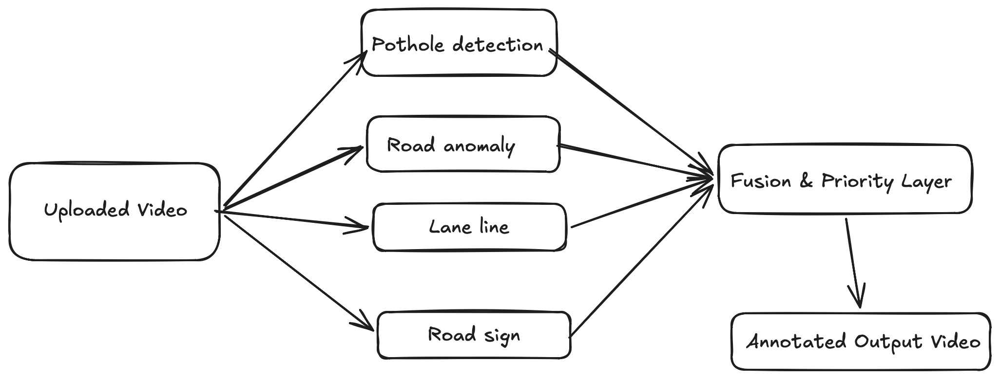

# Dashcam Safety Monitor

Real-Time Multi-Model Vision Pipeline for Road Hazard Detection, Priority Bounding Box Overlay, and Audio Emergency Alerts.

This is an academic, advisory driver-assistance demonstration. It does not control steering,
braking, throttle, or vehicle movement.

---

## Architecture


The implementation follows Chapters 4 and 5 of the interim report:

1. OpenCV samples uploaded video at an effective 10 FPS.
2. One frame is supplied to the four loaded YOLOv8 modules in a controlled sequence.
3. Road-sign, pothole, lane-segmentation, and anomaly outputs enter the central fusion layer.
4. The fusion layer applies confidence/geometric filters, spatial tracking, temporal voting,
   lane-departure logic, image-quality suppression, and alert priority.
5. One concise visual alert and its matching generated audio tone are communicated at a time.

### Report-aligned decision rules

| Module | Decision rule |
| :--- | :--- |
| Road sign | Confidence >= 0.60, NMS IoU 0.45, aspect ratio 0.5-1.5, area >= 0.5% of frame, 3-of-5 temporal confirmation |
| Pothole | Confidence >= 0.40, NMS IoU 0.40, same spatial track at IoU > 0.30, 15 detections in 20 processed frames, ego-lane and far/medium/near rules |
| Lane departure | Second-order fit from segmentation polygons, EMA alpha 0.70, absolute offset >= 35% of lane width for 1.5 seconds, suppressed by the matching turn signal; clears below 20% |
| Road anomaly | Accident, Car Fire, Fighting, or Snatching; confidence >= 0.55; same spatial track at IoU > 0.30; 4 detections in 6 processed frames |

Alert priority is `anomaly > lane departure > pothole > road sign`. Cross-module alert
duplicates use IoU > 0.50. The visual banner lasts 2 seconds and communication is limited to
one alert per 5-second window. Low image sharpness or brightness outside the configured
range suppresses alerts without hiding the raw model overlay.

Audio is disabled until the user explicitly enables it. The browser generates distinct local
tones for anomaly, lane-departure, pothole, and road-sign alerts and can speak the winning
rule's warning message using the browser speech-synthesis service.

Every temporally confirmed road-surface hazard has an audio key, including far
information-level alerts. The four model outputs - `Pothole`, `alligator_crack`,
`longitudinal_crack`, and `transverse_crack` - have distinct messages and do not all claim to
be severe potholes. Every class emitted by the current 35-class road-sign model is covered by
either a specific rule or the wildcard sign rule and is converted to a natural spoken message
such as `Pedestrian crossing ahead`.

## Configurable rule set

All alert decisions are defined in
`dashcam-safety-monitor-backend/ml_pipeline/rules.yml`. Application code supports the
fields and conditions; the YAML controls thresholds, enabled rules, temporal voting, messages,
cooldowns, and priority.

Priorities are integers from `0` to the number of configured rules. A higher number wins.
When several rules match the same frame, only the highest-priority rule becomes the primary
visual/audio alert. Lower-priority candidates are retained in `primary_alert.suppressed_alerts`
with their suppression reason. A newly detected higher-priority rule can interrupt a
lower-priority cooldown.

Example overspeed rule:

```yaml
id: speed-limit-exceeded
enabled: true
module: road_sign
labels: [Speed Limit]
minimum_confidence: 0.60
severity: warning
priority: 9
temporal:
  window_frames: 5
  minimum_hits: 3
  minimum_duration_ms: 1500
visual_duration_ms: 2000
cooldown_ms: 5000
message: Reduce speed - {vehicle_speed_kmh} km/h in a {speed_limit_kmh} km/h zone
audio_key: road_sign
conditions:
  speed_limit_exceeded: true
  speed_tolerance_kmh: 5
```

The rule fires only when a validated speed-limit sign has been temporally confirmed and:

```text
simulated_vehicle_speed_kmh > detected_speed_limit_kmh + speed_tolerance_kmh
```

The dashboard labels this value as simulated. It is not presented as real vehicle sensor data.

Rule API:

- `GET /api/rules` returns the complete active rule set.
- `PUT /api/rules` validates, saves, and activates a complete replacement rule set.

Unknown fields, unsupported conditions, duplicate IDs, invalid temporal voting, and priorities
outside the permitted range are rejected. Rule changes should be made before processing a
journey because activating a replacement resets temporal alert state.

---

## Environment Configurations (`.env`)

Backend environment variables are configured in [`dashcam-safety-monitor-backend/.env`](file:///Users/paranietharan/Documents/Codes/Tensor-Minds/dashcam-safety-monitor/dashcam-safety-monitor-backend/.env).

### Backend Model & Detection Confidence Settings

| Variable Name | Type | Default | Stage | Description |
| :--- | :--- | :--- | :--- | :--- |
| `CONF_ROAD_SIGN` | `float` | `0.15` | Inference | Model confidence threshold for Road Signs |
| `CONF_POTHOLE` | `float` | `0.15` | Inference | Model confidence threshold for Potholes |
| `CONF_ANOMALY` | `float` | `0.15` | Inference | Model confidence threshold for Road Anomalies |
| `CONF_LANE_LINE` | `float` | `0.15` | Inference | Model confidence threshold for Lane Lines |
| `DEFAULT_MODEL_CONFIDENCE` | `float` | `0.15` | Inference | Fallback model confidence threshold |
| `DET_CONF_ROAD_SIGN` | `float` | `0.15` | Post-Filter | Output detection filter threshold for Road Signs |
| `DET_CONF_POTHOLE` | `float` | `0.15` | Post-Filter | Output detection filter threshold for Potholes |
| `DET_CONF_ANOMALY` | `float` | `0.15` | Post-Filter | Output detection filter threshold for Road Anomalies |
| `DET_CONF_LANE_LINE` | `float` | `0.15` | Post-Filter | Output detection filter threshold for Lane Lines |
| `DEFAULT_DETECTION_CONFIDENCE` | `float` | `0.15` | Post-Filter | Fallback detection filter threshold |
| `IMAGE_QUALITY_BLUR_THRESHOLD` | `float` | `80` | Alert filter | Minimum variance-of-Laplacian score before alerts are allowed |
| `ALERT_RULES_PATH` | `path` | `ml_pipeline/rules.yml` | Rules | Optional path to an alternative validated YAML rule set |

### Frontend Settings (`dashcam-safety-monitor-frontend/.env.local`)

| Variable Name | Default | Description |
| :--- | :--- | :--- |
| `NEXT_PUBLIC_API_URL` | `http://localhost:8000` | FastAPI Backend REST API Host |
| `NEXT_PUBLIC_WS_URL` | `ws://localhost:8000/ws/video` | Real-Time Video Safety Stream WebSocket Endpoint |

## Run

```bash
cd dashcam-safety-monitor-backend
python3 -m venv venv
source venv/bin/activate
pip install -r requirements.txt
python3 main.py
```

```bash
cd dashcam-safety-monitor-frontend
npm install
npm run dev
```

Open `http://localhost:3000`, select the required modules, upload a video, enable alert audio,
and start the live safety stream or generate the annotated MP4.

## Known limitations

- Turn-signal state is a clearly labelled demo input; no CAN bus is connected.
- Exact distance, vehicle speed, and GPS coordinates are not displayed because no calibrated
  camera, speed sensor, or GPS source is connected.
- Lane departure requires two usable segmented lane boundaries.
- OpenCV's `mp4v` output may require FFmpeg conversion on browsers that cannot decode it.
- Report performance targets must be measured on the intended Jetson or Raspberry Pi AI
  hardware; they are not claimed by this implementation.
